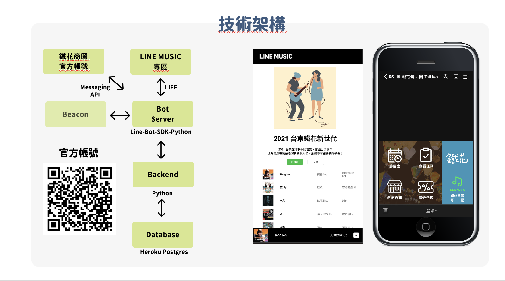
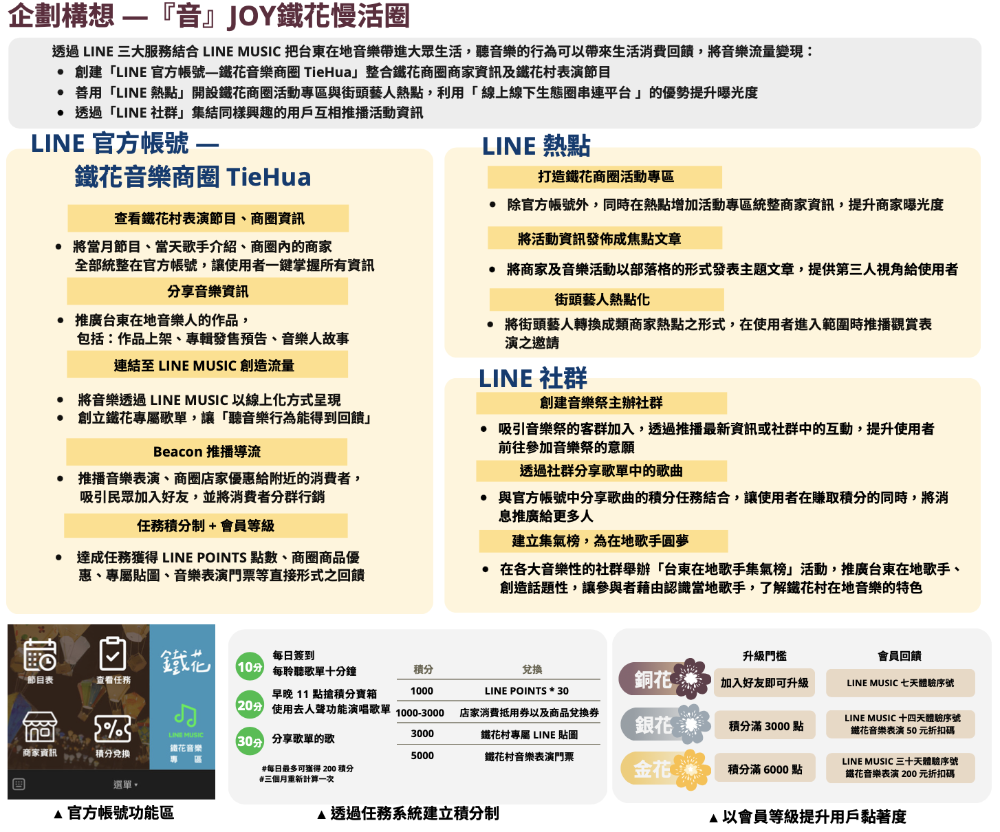

# LINE-FRESH-2021

## 程式架構

#### 1. linefresh-tiehua: LineBot鐵花商圈官方帳號
#### 2. liff-linemusic: 模擬Line Music串連鐵花官方帳號的流量變現功能，呈現在rich menu中
#### 3. liff-qrcode: 官方帳號行銷活動之一，掃描消費發票累積點數，將線下結合線上。呈現在rich menu中

### 為了有效提升台東鐵花商圈的曝光度，我們整合了LINE多項數位服務，並以串流音樂LINE MUSIC為核心，把獨具特色的在地音樂帶進年輕世代生活中，並嘗試將流量變現，轉化為人流以及商機，同時更藉由LINE官方帳號整併商圈商家資訊與表演節目，善用LINE熱點設立活動專區與街頭藝人熱點地圖，以LINE社群集結、串聯擁有相同興趣的用戶，提升鐵花商圈的討論熱度。

